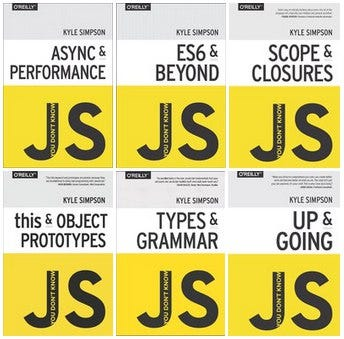

=========================== learning flow ==============
Array method ->

=========================== Some Javascript Resource by Setu ================

udemy: https://www.udemy.com/course/the-complete-javascript-course/?srsltid=AfmBOoqNHNjkAaw5Qtyt3o6AZNkfrHfXfLsjM4zA9a9SQbrrAtGS0FCf&couponCode=LETSLEARNNOW

udemy: https://www.udemy.com/course/understand-javascript/?utm_source=adwords&utm_medium=udemyads&utm_campaign=Search_DSA_Alpha_Prof_la.EN_cc.ROW-English&campaigntype=Search&portfolio=ROW-English&language=EN&product=Course&test=&audience=DSA&topic=JavaScript&priority=Alpha&utm_content=deal4584&utm_term=_._ag_162511579324_._ad_696197165406_._kw__._de_c_._dm__._pl__._ti_dsa-1676636482719_._li_9069500_._pd__._&matchtype=&gad_source=1&gclid=CjwKCAiAmMC6BhA6EiwAdN5iLSIPqt91OhJcQQ348oHazeUYacqB69ONg5twk8KVSBG0CsMGRFdGshoCyjQQAvD_BwE&couponCode=2021PM25

3. Book: Advance Javascript with Kyle Simpson..

4. youtube video: 10 javascript projects in 10 hours florin pop
